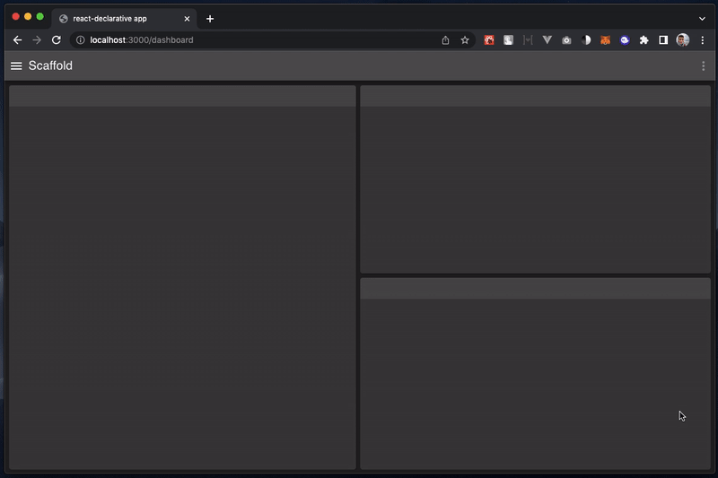

# ⚛️ cra-template-react-declarative

> Contains the most advanced `todo-list` which you ever seen!

[](https://npmjs.org/package/cra-template-react-declarative)



## Usage

```bash
npx create-react-app . --template=react-declarative
```

## What's inside

1. [TypeScript](https://www.typescriptlang.org/)
2. [MUI](https://mui.com/)
3. [Mobx](https://mobx.js.org/)
4. [MSW](https://mswjs.io/)
5. [tss-react](https://www.tss-react.dev/)
6. [react-declarative](https://www.npmjs.com/package/react-declarative)

## Code sample

```tsx
import { FetchView, Breadcrumbs, One, FieldType, IField, usePreventLeave } from 'react-declarative';

import fetchApi from '../../helpers/fetchApi';
import history from '../../helpers/history';

interface ITodoOnePageProps {
    id: string;
}

const fields: IField[] = [
    {
        type: FieldType.Line,
        title: 'System info'
    },
    {
        type: FieldType.Div,
        style: {
          display: 'grid',
          gridTemplateColumns: '1fr auto',
        },
        fields: [
            {
                type: FieldType.Text,
                name: 'userId',
                title: 'User id',
                outlined: false,
                disabled: true,
            },
            {
                type: FieldType.Checkbox,
                fieldBottomMargin: "0",
                name: 'completed',
                title: "Completed",
                disabled: true,
            },
        ]
    },
    {
        type: FieldType.Line,
        title: 'Common info'
    },
    {
        type: FieldType.Text,
        name: 'title',
        title: 'Title',
    }
];

export const TodoOnePage = ({
    id,
}: ITodoOnePageProps) => {

    const fetchState = async () => await fetchApi(`/api/v1/todos/${id}`);

    const Content = (props: any) => {

        const {
            data,
            oneProps,
            beginSave,
        } = usePreventLeave({
            history,
            onSave: async () => {
                alert(JSON.stringify(data, null, 2));
                return true; // HTTP 200
            },
        });

        return (
            <>
                <Breadcrumbs
                    withSave
                    saveDisabled={!data}
                    title="Todo list"
                    subtitle={props.todo.title}
                    onSave={beginSave}
                    onBack={() => history.push('/todos')}
                />
                <One
                    handler={() => props.todo}
                    fields={fields}
                    {...oneProps}
                />
            </>
        );
    };

    return (
        <FetchView state={fetchState}>
            {(todo) => (
                <Content todo={todo} />
            )}
        </FetchView>
    );
};

export default TodoOnePage;
```
